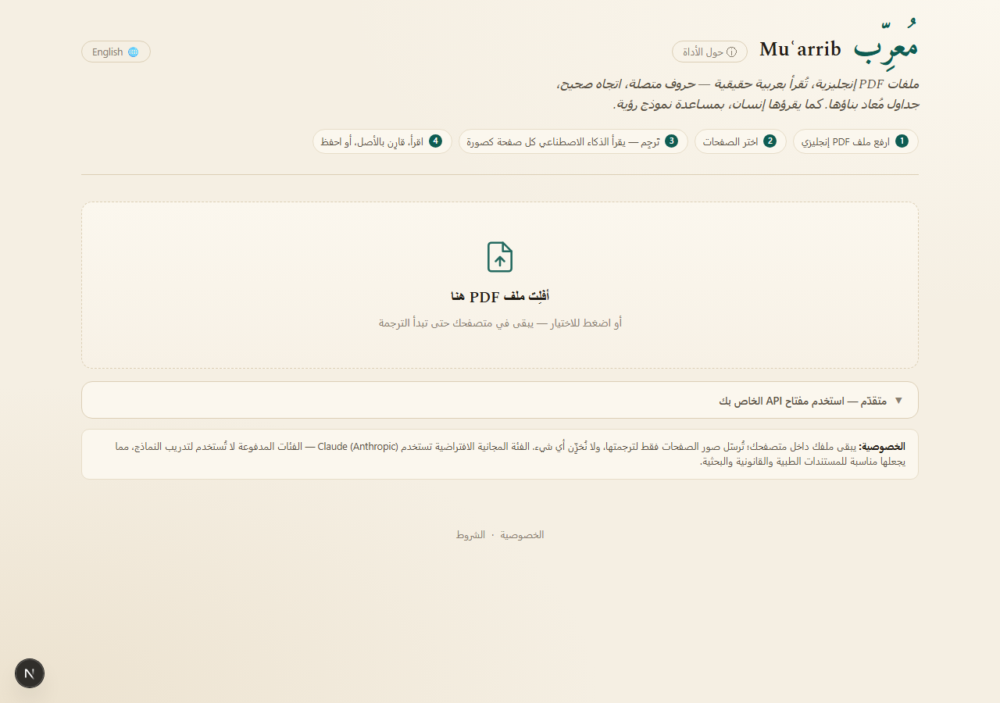

# Muʿarrib (مُعرّب)

Translates English PDFs into native, correctly-rendered Arabic — for anyone who's tried to machine-translate a PDF into Arabic and gotten back garbled, reversed, or disconnected letters instead of real text.

## The problem

Extract text from a PDF and feed it to a translator, and Arabic output frequently comes out corrupted: letters that don't join correctly, text running the wrong direction, shaping that depends on font/rendering quirks the extraction step threw away. This isn't a translation-quality problem — it's a text-encoding problem that happens *before* translation even starts.

Muʿarrib sidesteps it by never extracting text from the PDF at all. Each page is rendered to an **image** in the browser (via pdf.js) and a vision model reads that image directly, the same way a person would. Output is a reflowed Arabic reading view, not a pixel copy of the original layout — but the Arabic text in it is never at risk of shaping corruption, because it was never extracted as text in the first place.

## Screenshot



*(The interface, in its Arabic-first default. A translated-page screenshot will be added once a live deployment with a configured provider key exists — see Known limitations.)*

## Live demo

**https://muarrib.vercel.app** — deployed, but translation is not yet functional there: the Anthropic key and Cloudflare Turnstile keys haven't been configured in the production environment yet. The UI loads and is real; uploading a PDF will currently fail past the verification/translate step. This will be updated once that's wired up.

## Quickstart

```bash
npm install
cp .env.example .env   # fill in at least ANTHROPIC_API_KEY or GEMINI_API_KEY
npm run dev
```

Open `http://localhost:3000`. Verified from a clean clone: `npm install` → `npm run build` → `npm run dev` all succeed with no env vars set (the app boots and serves the UI; you only need a key in `.env` to actually translate a page).

## How it works

- PDF rendering happens **entirely client-side** (pdf.js loaded via CDN) — the full PDF file is never uploaded, only individual rendered page images.
- Each page image is sent to `POST /api/translate-page`, gated by a Cloudflare Turnstile check (once per IP per day) and per-IP/global rate limits before any paid API call happens.
- The page image goes to a vision model (Anthropic Claude by default, or a user-supplied Gemini/Anthropic key) with a structured prompt asking for JSON blocks (heading/paragraph/list/table/etc.), not free text.
- If the model's response comes back truncated or fails to parse, the client splits the page image top/bottom and retries as two calls — this only happens reactively, not on every page.
- Before rendering the result, `lib/number-guard.ts` diffs every number in the source page against the translated output and flags anything that went missing.
- Output renders as a right-to-left Arabic reading view, with a toggle to show original English terms inline, and can be exported to Word/HTML/print-to-PDF.

## Design decisions

**The number-guard is the part that actually matters.** (`lib/number-guard.ts`, wired into `app/muarrib-app.tsx`) A naive translator trusts the vision model's transcription completely. For a tool that's explicitly positioned for things like drug dosage leaflets, a clumsy sentence is embarrassing but a silently-dropped "500mg" is dangerous. So every number in the source page (normalized across Western, Arabic-Indic ٥٠٠, and Persian ۵۰۰ digit forms) is extracted and diffed against the translated output; anything present in the source but absent from the translation gets flagged for the user to check against the original. It's a flagging aid, not a correctness guarantee — it complements the prompt's instruction to transcribe numbers verbatim, it doesn't replace it.

**Vision over extraction.** Covered above — the whole architecture exists because PDF text-layer extraction is the wrong tool for Arabic output, not just a slower one.

**Redis with an in-memory fallback.** (`lib/cache-store.ts`, `lib/rate-store.ts`, `lib/metrics-store.ts`) All three stateful concerns (cache, rate limits, metrics) check for `UPSTASH_REDIS_REST_URL`/`UPSTASH_REDIS_REST_TOKEN` at startup and use Upstash Redis if present, otherwise fall back to an in-memory store. That makes local dev and testing require zero infrastructure, while production (multi-instance, serverless) gets a shared, durable store — same interface, no code branching at the call site.

**Reliability layer around provider calls.** (`lib/reliable-call.ts`) Wraps every provider call with a timeout (under Vercel's function window) and bounded retries — but only for genuinely transient failures (429/503/timeout); auth and validation errors fail fast instead of burning retry budget on something a retry can't fix. Now covered by tests (see below) including the specific case where a retry's backoff wouldn't fit in the remaining time budget.

## Known limitations

- **Deployed, but not yet configured.** https://muarrib.vercel.app is live (auto-deployed via the Vercel↔GitHub integration), but production env vars (`ANTHROPIC_API_KEY`, Turnstile keys, etc.) aren't set yet, so translation doesn't work there yet — only local dev with a `.env` does.
- **Test coverage is at the logic layer, not integration.** `npm test` covers the four pure/mockable modules that matter most for correctness (`number-guard`, `reliable-call`, `abuse-guard`, `turnstile`) — 47 tests, all passing. The Next.js route handlers themselves (`app/api/*/route.ts`) and the provider adapters (`lib/providers/*.ts`) have no tests yet. There's also no CI configured to run `npm test` automatically on push.
- **60-second function timeout on Vercel's Hobby plan** (`export const maxDuration = 60` on the translate route). A dense page that triggers a split (two half-page calls) plus a Gemini 429 retry can approach that ceiling. Fine on the default Anthropic path in practice; worth watching under Gemini BYOK on hostile input.
- **In-memory fallback is single-instance only.** Without Upstash Redis configured, rate limits and the daily-verification flag reset per serverless instance — fine for local dev, not safe for a real multi-instance production deploy.
